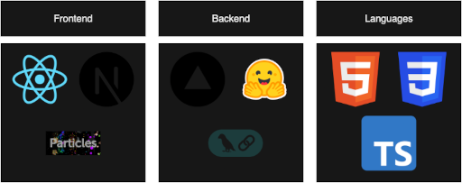

# Kedar Panchal's Portfolio Website  
[Website link](https://kpanchal.vercel.app/)

Welcome to my personal portfolio! This site showcases my projects, experience, and skills as a Computer Science and Engineering student at Texas A&M. 

## Table of Contents
* [Features](#features)
* [Tech Stack](#tech-stack)
* [License](#license)
* [Contact Me](#contact-me)

## Features
[Back to top](#table-of-contents)

* Responsive user interface for multiple platforms
* Dynamic mobile navigation bar
* RAG-powered, agentic AI chatbot to discuss my work experience, projects, skills, and more
    * Orchestrates local and cloud-based models for a smooth generative AI pipeline
* Interactive particle effects in the background

## Tech Stack
[Back to top](#table-of-contents)

    

* **Frontend**:
    * [React](https://react.dev/)
    * [Next.js](https://nextjs.org/)
    * [tsparticles](https://particles.js.org/)
* **Backend**
    * [Vercel](https://vercel.com/)
    * [transformers.js](http://huggingface.co/docs/transformers.js/en/index)
    * [langchain.js](https://js.langchain.com/docs/introduction/)
* **Languages**
    * HTML
    * CSS
    * TypeScript

## License
[Back to top](#table-of-contents)

* **Code:** [BSD 3-Clause License](LICENSE)
* **Content (text, resume, RAG model context):** [CC BY-NC-ND 4.0](https://creativecommons.org/licenses/by-nc-nd/4.0/)

Feel free to reference the code for learning or personal use. Please do not reuse content, images, or writing without permission.

## Contact Me
[Back to top](#table-of-contents)

* Email: kedar.t.panchal@outlook.com
* LinkedIn: [Kedar Panchal](https://www.linkedin.com/in/kedarpanchal/)
* GitHub: [KedarPanchal](https://github.com/KedarPanchal/)
* Hugging Face: [KedarPanchal](https://huggingface.co/KedarPanchal)
